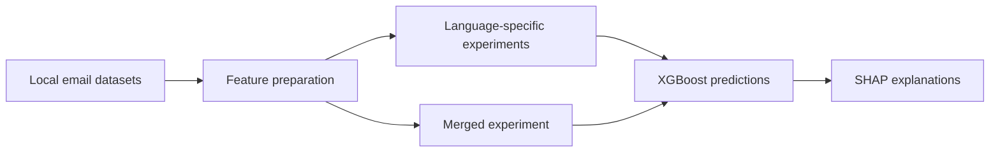

<div align="center">

**Interpretable email analysis in English and Hindi.**

Python · XGBoost · SHAP · SMOTE · pandas

[Portfolio](https://harshil-prashant-shah.vercel.app/) · [LinkedIn](https://www.linkedin.com/in/harshilpshah/) · [Explore the code](#repository-guide)

</div>

---

## What this project explores

An interpretable approach to suspicious-email classification across English and Hindi, combining engineered email features with tree-based models and feature explanations.

### Core components

- Features derived from senders, domains, timestamps, keywords, text lengths, links, and sentiment.
- Separate language-specific and merged-model experiments.
- SMOTE-based class balancing in experimental training workflows.
- SHAP explanations and heuristic suspicion categories.

## Workflow



## Run locally

```bash
python -m venv .venv
source .venv/bin/activate
pip install -r requirements.txt
jupyter lab notebooks/phishing-email-detection.ipynb
```

On Windows, activate with `.venv\Scripts\activate`. Add the authorized local datasets following [DATA_SETUP.md](DATA_SETUP.md) before running the notebook. `PROJECT_DATA_DIR` can point to a separate directory. Some legacy WHOIS experiments require network access.

## Repository guide

- `notebooks/phishing-email-detection.ipynb` — research notebook with local-path configuration.
- `DATA_SETUP.md` — expected files and directory layout.
- `VALIDATION.md` — dataset checks and evaluation limitations.
- `requirements.txt` — dependencies inferred from imports.

## What has been checked

The supplied English dataset has **38,668 records**; the Hindi dataset has **20,000 records**. Required columns were checked locally. Missing English bodies and repeated content in both datasets are documented in [VALIDATION.md](VALIDATION.md).

A full held-out model evaluation is not yet established. Equivalent email bodies must stay within the same split to avoid leakage. Spam/ham labels require careful interpretation before being treated as phishing ground truth. SHAP explains model output; it does not verify that an email is safe.

## Research

[Read the associated paper or manuscript](https://ieeexplore.ieee.org/document/11566454). This reference was supplied by the author; publisher or Drive access conditions may apply. The paper and this repository may represent different project stages.

## About the author

**Harshil Prashant Shah** · MS in Management Information Systems, Texas A&M University.

[Portfolio](https://harshil-prashant-shah.vercel.app/) · [LinkedIn](https://www.linkedin.com/in/harshilpshah/) · [GitHub](https://github.com/harshilshah250504)

## Data and reuse

Local datasets, credentials, and third-party research PDFs are not included. No blanket license is granted over third-party material. Refer to the original sources for their terms before redistributing data or publications.
